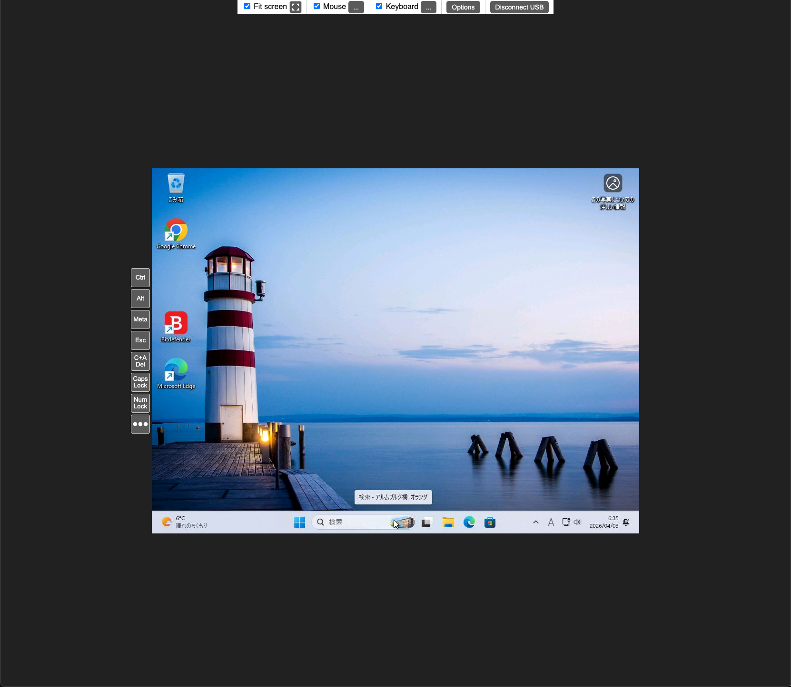

# go-zerokvm

このプロジェクトは、[doominator42](https://github.com/doominator42)氏によるオリジナルの[ZeroKVM](https://github.com/doominator42/ZeroKVM)をGo言語に移植したものです。
Go-zerokvmは、低コストで簡単に構築できるKVM-over-IPデバイスです。ターゲットホストからは、DisplayLinkモニタおよび標準的なUSBキーボード/マウスとして認識されます。
オリジナルのプロジェクトにおけるdoominator42氏の素晴らしい成果に感謝いたします。


## 特徴

- **DisplayLinkプロトコルの実装**: ホストの画面信号をキャプチャし、ウェブブラウザに表示します。
- **USB HIDエミュレーション**: キーボード、絶対座標マウス、相対座標マウスをエミュレートします。
- **ウェブコンソール**: ブラウザから直接、直感的なリモート操作が可能です。
- **マルチアーキテクチャ対応**: Raspberry Pi Zero/2/3/4/5などのARMベースのLinuxデバイスで動作します。
- **CGO不要**: 純粋なGo実装により、クロスコンパイルが非常に容易です。

## スクリーンショット



## 必要条件

- **ハードウェア**: USB OTG (USB 2.0 Device/Gadgetモード) をサポートするLinuxデバイス (例: Raspberry Pi Zero, 4, 5)。
- **OS**: ConfigFSおよびFunctionFSが有効なLinux。

## セットアップ (ZeroKVMデバイス側)

Raspberry Piユーザーの場合、以下の設定が必要です。

### 1. カーネルオーバーレイの有効化
`/boot/config.txt` (または `/boot/firmware/config.txt`) に以下の行を追加します。
```text
dtoverlay=dwc2
```

### 2. カーネルモジュールのロード
`/etc/modules` に以下の行を追加して再起動するか、`modprobe` で手動でロードします。
```text
dwc2
libcomposite
```

### 3. パーミッション
このプログラムはUSBガジェット (ConfigFS) を設定し、FunctionFSエンドポイントを操作するため、**ルート権限** (sudo) で実行する必要があります。

## ホストPC (ターゲット) の要件

ZeroKVMに接続されるターゲットPCには、DisplayLinkドライバが必要です。

- **Linux**: カーネル3.4以降にはメインラインの `udl` ドライバが含まれています。認識されない場合は `lsmod | grep udl` で確認してください。
- **Windows**: 通常、Windows Update経由で自動的にインストールされます。
- **macOS / Android**: 公式サイトから「DisplayLink Manager」(またはDisplayLink Presenter) をインストールする必要があります。

## 設定

実行時に以下の引数を指定できます。

| 引数 | 説明 | デフォルト |
| :--- | :--- | :--- |
| `-udc` | USBコントローラの名称 (必須) | (なし) |
| `-name` | ガジェット名 | `zerokvm` |
| `-listen` | ウェブUIの待機アドレス | `:8080` |

### UDC名の確認
```bash
ls /sys/class/udc
# 例: fe980000.usb
```

## 操作方法

1. **ビルド**:
   [mise](https://mise.jdx.dev/) を使用する場合:
   ```bash
   mise run build:all
   ```
   手動ビルド (例: ARM64用):
   ```bash
   GOOS=linux GOARCH=arm64 CGO_ENABLED=0 go build -o go-zerokvm
   ```

2. **実行**:
   ```bash
   sudo ./go-zerokvm -udc <UDC名>
   ```

3. **使用方法**:
   ZeroKVMデバイスのUSB OTGポートをホストPCのUSBポートに接続し、ウェブブラウザで `http://<device-ip>:8080` にアクセスします。

## ライセンス
このプロジェクトは [Apache License 2.0](LICENSE) の下でライセンスされています。
